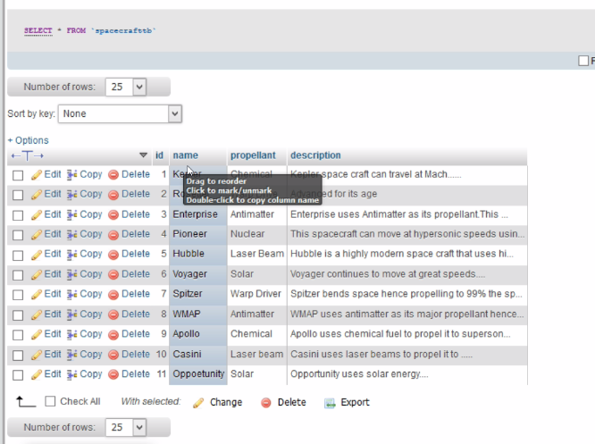

# RecyclerMySQLMultiColumn
Select several columns from MySQL database and show in RecyclerView.

Here is our table structure:

 

 * First We Connect to MySQL Database.
 * We do this via PHP.
 * We retrieve data in json format.
 * Parse this JSON and show our result in RecyclerView.
 * We work with multiple columns.
 * We offload the background work to AsyncTask.
 * Show progress dialog while loading data.
 * We also parse the JSON in the background thread via native JSONObject and JSONArray classes.
 
 
 
 
